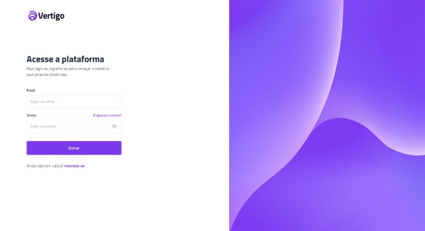

<h1 align="center"> Login Page </h1>

<a href="#-tecnologias">Tecnologias</a>&nbsp;&nbsp;&nbsp;|&nbsp;&nbsp;&nbsp;
<a href="#-projeto">Projeto</a>&nbsp;&nbsp;&nbsp;&nbsp;&nbsp;&nbsp;

 

## 🚀 Tecnologias

Esse projeto foi desenvolvido com as seguintes tecnologias:

- HTML e CSS
- JS
- Figma

## 💻 Projeto

Login Page using HTML, CSS and JS only

- [Acesse o projeto finalizado, online](https://sidneihenrique.github.io/login-page)

